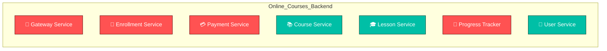

# 🧭 Online_Courses_Backend — Progress Outlook

> Auto-generated on 2025-10-15 14:27:23

## 📦 Microservice Architecture Overview

## ✅ Development Checklist
| Service | Port | Status |
|----------|------|---------|
| Gateway | 9601 | ⏳ Todo |
| Enrollment | 9598 | ⏳ Todo |
| Payment | 9599 | ⏳ Todo |
| Course | 9596 | ✅ Done |
| Lesson | 9597 | ✅ Done |
| Progress | 9600 | ⏳ Todo |
| User | 9595 | ✅ Done |

🗓️ **Last Updated:** 2025-10-15 14:27:23

> 💡 Mark a service as done by creating a .done file inside it, or mark as in progress with a .progress file.
