# 🧭 Online_Courses_Backend

An advanced Spring Boot microservice-based backend for an online learning platform.

---

<!-- AUTO-GENERATED: PROGRESS_START -->
## 📦 Microservice Architecture Overview

```mermaid
flowchart LR
    subgraph G[Online_Courses_Backend]
        gateway_service[🚪 Gateway Service]:::todo
        enrollment_service[🪪 Enrollment Service]:::todo
        payment_service[💳 Payment Service]:::todo
        course_service[📚 Course Service]:::done
        lesson_service[🎓 Lesson Service]:::done
        progress_service[🧩 Progress Tracker]:::todo
        user_service[👥 User Service]:::done
    end

    classDef done fill:#00BFA6,stroke:#003F2E,color:#fff;
    classDef in_progress fill:#FFD54F,stroke:#7B5E00,color:#000;
    classDef todo fill:#FF5252,stroke:#5A0000,color:#fff;
    classDef planned fill:#9E9E9E,stroke:#2F2F2F,color:#fff;
```

## ✅ Development Checklist
| Service | Port | Status |
|----------|------|---------|
| Gateway | 9601 | ⏳ Todo |
| Enrollment | 9598 | ⏳ Todo |
| Payment | 9599 | ⏳ Todo |
| Course | 9596 | ✅ Done |
| Lesson | 9597 | ✅ Done |
| Progress | 9600 | ⏳ Todo |
| User | 9595 | ✅ Done |

🗓️ **Last Updated:** 2025-10-15 14:26:58
<!-- AUTO-GENERATED: PROGRESS_END -->

---
